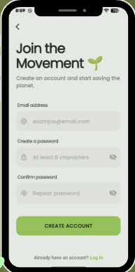
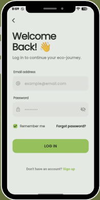
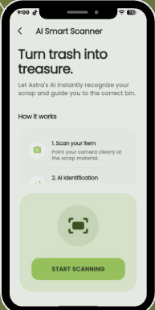
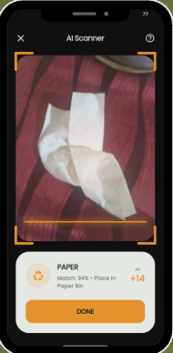
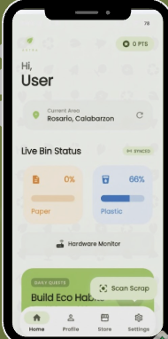
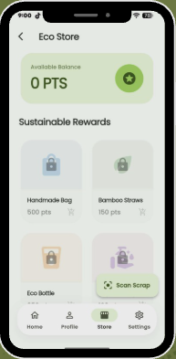
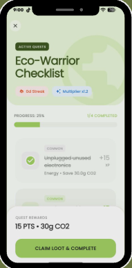

<div align="center">

# 🗑️ Astra Smart Bin

**An AI-powered waste segregation system that identifies recyclable materials using a mobile camera, controls physical sorting bins via Arduino, and tracks user eco-habits through a gamified mobile app.**


</div>

---

## 📋 Table of Contents

- [Problem Statement](#-problem-statement)
- [Solution](#-solution)
- [Screenshots](#-screenshots)
- [Features](#-features)
- [Architecture](#-architecture)
- [Tech Stack](#-tech-stack)
- [Installation](#-installation)
- [How It Works](#-how-it-works)
- [Folder Structure](#-folder-structure)
- [Challenges](#-challenges)
- [Future Improvements](#-future-improvements)
- [Author](#-author)

---

## 🎯 Problem Statement

Improper waste segregation remains one of the biggest barriers to effective recycling worldwide. In the Philippines, the lack of accessible, user-friendly recycling infrastructure leads to:

- **Low recycling rates** — Most recyclable materials end up in landfills due to confusion about what can be recycled
- **Manual sorting inefficiency** — Waste workers manually sort mixed waste, which is slow, hazardous, and error-prone
- **No incentive system** — Users have no motivation to properly segregate their waste
- **No bin capacity monitoring** — overflowing bins go unnoticed, leading to littering and health hazards
- **Lack of awareness** — People don't know the environmental impact of their waste habits

---

## 💡 Solution

**Astra Smart Bin** is an integrated hardware-software system that automates waste segregation and incentivizes proper recycling. The system:

1. **Scans waste items** using a smartphone camera powered by a TensorFlow Lite ML model
2. **Identifies the material type** (plastic, paper, metal) with real-time confidence scoring
3. **Activates the correct physical bin** via Arduino-controlled servo motors
4. **Monitors bin capacity** using ultrasonic sensors to detect fill levels
5. **Rewards users** with eco-points for proper recycling, redeemable at an eco-shop
6. **Tracks environmental impact** through CO₂ savings dashboards and habit checklists

---

## 📸 Screenshots

### Authentication & Onboarding
| Login | Sign Up |
|:-----:|:-------:|
|  |  |

### AI Waste Scanner
| Scan Detection | Classification Result |
|:--------------:|:---------------------:|
|  |  |

### Smart Bin Monitoring
| Bin Fill Level Dashboard |
|:------------------------:|
|  |

### Eco-Points & Rewards
| Points Earned | Points History |
|:-------------:|:--------------:|
|  |  |

---

## ✨ Features

### 📱 Mobile App (Flutter)
- **AI Waste Scanner** — Point your camera at any waste item to identify its material type (plastic, paper, metal) using an on-device TensorFlow Lite model
- **Real-Time Classification** — Instant detection with confidence scores, no internet required for inference
- **Eco-Points System** — Earn points for every properly scanned and recycled item
- **Eco-Shop** — Redeem accumulated points for rewards and eco-friendly products
- **CO₂ Dashboard** — Visualize your personal environmental impact through carbon savings tracking
- **Habit Checklist** — Daily eco-friendly habit tracker to build sustainable routines
- **Bin Fill Levels** — Monitor real-time capacity of each smart bin via IoT sensors
- **User Authentication** — Secure login, signup, password reset, and profile management
- **My Collection** — View history of all scanned and recycled items

### 🤖 AI Vision System (Python + TensorFlow Lite)
- **On-Device ML Inference** — TensorFlow Lite model trained to classify recyclable materials
- **Real-Time Detection** — Continuous camera feed with live classification overlay
- **Confidence Scoring** — Displays detection confidence to filter low-quality predictions
- **Cooldown System** — Prevents duplicate triggers from the same item
- **Backend Bridge** — Sends classification results to Arduino via serial communication

### 🔌 Arduino Hardware (C++)
- **Automated Bin Sorting** — Servo motors open the correct bin lid based on detected material
- **Ultrasonic Sensors** — Monitor fill levels of plastic, paper, and metal compartments
- **Multi-Bin Support** — Separate bins for plastic, paper, and metal with independent control
- **Serial Communication** — Receives commands from Python backend via USB serial

### 🌐 Backend Bridge (Python + Flask)
- **Flask REST API** — Exposes bin levels and control endpoints for the mobile app
- **Arduino Serial Bridge** — Bridges communication between Flutter app and Arduino hardware
- **Auto-Port Detection** — Automatically detects Arduino serial port (COM/USB)
- **CORS Enabled** — Allows cross-origin requests from the Flutter app

---

## 🏗️ Architecture

```
┌──────────────────────┐
│   Flutter Mobile App │
│  (Camera + TFLite)   │
└──────────┬───────────┘
           │ HTTP REST API
           ▼
┌──────────────────────┐    Serial    ┌──────────────────┐
│   Python Backend     │◄────────────►│  Arduino UNO     │
│  (Flask + Bridge)    │    (USB)     │  (Servos +       │
│                      │              │   Ultrasonic)    │
└──────────┬───────────┘              └──────────────────┘
           │
           ▼
┌──────────────────────┐
│  TensorFlow Lite     │
│  Waste Classifier    │
│  (Plastic/Paper/     │
│   Metal)             │
└──────────────────────┘
```

### Data Flow
1. User opens camera in Flutter app → captures frame
2. TFLite model classifies the waste item (plastic/paper/metal)
3. Classification result sent to Python backend via HTTP
4. Backend forwards command to Arduino via serial (USB)
5. Arduino activates the correct servo motor to open the bin lid
6. Ultrasonic sensors read fill levels → sent back to backend
7. Backend serves fill levels to the Flutter dashboard
8. User earns eco-points for each successful recycle

---

## 🛠️ Tech Stack

### Mobile App
| Technology | Purpose |
|------------|---------|
| Flutter 3.10 | Cross-platform mobile framework (Android, iOS, Web) |
| TensorFlow Lite | On-device ML inference for waste classification |
| Camera | Real-time video feed for waste scanning |
| Geolocator | Location services for nearby bin finding |
| HTTP | REST API communication with backend |

### AI / Vision
| Technology | Purpose |
|------------|---------|
| Python 3.10 | Scripting and ML pipeline |
| TensorFlow / TFLite | Model training and inference |
| OpenCV | Camera capture and image preprocessing |
| NumPy | Numerical operations for image processing |
| Matplotlib | Training visualization |

### Backend
| Technology | Purpose |
|------------|---------|
| Flask | Lightweight REST API server |
| Flask-CORS | Cross-origin resource sharing |
| PySerial | Arduino serial communication |

### Hardware
| Technology | Purpose |
|------------|---------|
| Arduino UNO | Microcontroller for bin control |
| Servo Motors | Automated bin lid opening |
| Ultrasonic Sensors | Bin fill-level detection |

---

## 🚀 Installation

### Prerequisites
- Python 3.10+
- Flutter SDK 3.10+
- Arduino IDE
- USB cable for Arduino connection

### 1. AI Vision System

```bash
cd vision
pip install -r ../requirements.txt
python vision_detector.py
```

### 2. Backend Bridge

```bash
cd backend
pip install flask flask-cors pyserial
python connector.py
```

### 3. Flutter Mobile App

```bash
cd mobile
flutter pub get
flutter run
```

### 4. Arduino Hardware

1. Open `arduino/arduino.ino` in Arduino IDE
2. Select your board (Arduino UNO) and port
3. Upload the sketch
4. Connect the servo motors and ultrasonic sensors as defined in the pin configuration

### Hardware Wiring

| Component | Pin |
|-----------|-----|
| Plastic Ultrasonic Trig | D2 |
| Plastic Ultrasonic Echo | D4 |
| Plastic Servo | D3 |
| Paper Ultrasonic Trig | D7 |
| Paper Ultrasonic Echo | D9 |
| Paper Servo | D5 |

---

## ⚙️ How It Works

### Waste Scanning Flow
1. **Capture** — User points camera at a waste item
2. **Classify** — TFLite model runs inference on the captured frame
3. **Identify** — Model outputs material type (plastic/paper/metal) with confidence score
4. **Command** — Classification sent to backend → forwarded to Arduino
5. **Sort** — Arduino opens the correct bin lid via servo motor
6. **Reward** — User earns eco-points for the recycled item

### Bin Monitoring Flow
1. **Sense** — Ultrasonic sensors measure distance to waste surface
2. **Calculate** — Arduino computes fill percentage based on bin depth
3. **Transmit** — Fill levels sent to backend via serial
4. **Display** — Flutter app shows real-time bin capacity dashboard
5. **Alert** — Users notified when bins approach full capacity

---

## 📁 Folder Structure

```
Astra_Smart_Bin/
├── arduino/
│   └── arduino.ino              # Arduino sketch for bin control
│
├── backend/
│   ├── arduino_bridge.py        # Flask API + serial bridge
│   └── connector.py             # Simplified connector
│
├── vision/
│   ├── vision_detector.py       # TFLite waste classifier
│   ├── models/                  # Trained TFLite models
│   └── dataset/                 # Training data (paper, plastic, metal)
│
├── mobile/
│   └── lib/
│       ├── main.dart            # App entry point
│       ├── screens/             # UI screens (14 screens)
│       │   ├── camera_scanner_screen.dart
│       │   ├── home_screen.dart
│       │   ├── co2_dashboard_screen.dart
│       │   ├── eco_shop_screen.dart
│       │   ├── habit_checklist_screen.dart
│       │   ├── bin_level_service.dart
│       │   └── ...
│       ├── backend/             # API service layer
│       └── widgets/             # Shared UI components
│
├── screenshots/                 # App screenshots
├── legacy/                      # Previous project versions
├── requirements.txt             # Python dependencies
└── README.md
```

---

## 🧩 Challenges

### 1. On-Device ML Performance
**Challenge:** Running TensorFlow Lite inference on mobile devices without lag.  
**Solution:** Used TFLite-optimized quantized models. The model runs at ~30ms per frame on mid-range devices, enabling real-time scanning without internet dependency.

### 2. Arduino-Software Communication
**Challenge:** Bridging communication between a Flutter app and Arduino hardware.  
**Solution:** Built a Python Flask backend as a middleware. The backend receives HTTP requests from Flutter and translates them into serial commands for Arduino, with auto-port detection for plug-and-play setup.

### 3. Bin Lid Automation
**Challenge:** Different materials require different bin mechanisms (180° servo for plastic, 360° continuous rotation for paper).  
**Solution:** Configured separate servo control logic for each bin type — positional control for plastic lids and timed spin control for paper compartment doors.

### 4. Real-Time Fill Level Monitoring
**Challenge:** Accurately measuring bin capacity without complex sensors.  
**Solution:** Used HC-SR04 ultrasonic sensors with a calibrated depth constant. The sensor measures distance to the waste surface, and fill percentage is calculated as `(binDepth - measuredDistance) / binDepth × 100`.

### 5. Cross-Platform Consistency
**Challenge:** Ensuring the Flutter app works identically across Android, iOS, and web.  
**Solution:** Used platform-conditional camera and sensor access, with graceful degradation on web (scanner disabled, manual input fallback).

---

## 🔮 Future Improvements

| Priority | Feature | Description |
|----------|---------|-------------|
| High | **Cloud Database** | Store scan history and user data in Firebase/Supabase instead of local storage |
| High | **GPS Bin Finder** | Show nearby smart bins on a map using geolocation |
| Medium | **Waste Categories** | Expand model to detect organic, glass, and electronic waste |
| Medium | **Multi-Language** | Add Filipino/Tagalog language support |
| Medium | **Push Notifications** | Alert users when bins are full or when new rewards are available |
| Medium | **Leaderboard** | Community ranking system to encourage collective recycling |
| Low | **OTA Model Updates** | Push updated ML models to devices without app updates |
| Low | **Carbon Credit Integration** | Connect to carbon credit marketplaces for verified offsets |
| Low | **Admin Dashboard** | Web interface for monitoring all bins across locations |

---

## 👤 Author

**Aye Nyein San**

- GitHub: [@AyeNyeinSan22](https://github.com/AyeNyeinSan22)
- Email: ayenyeinsan284@gmail.com

---

<div align="center">

**Built with 🌱 for a cleaner, greener planet**

</div>
